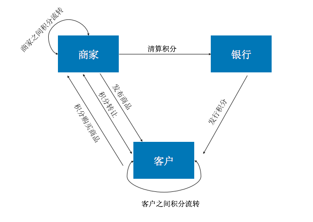

# Hyperchain-Score-Hella
## 简介
本项目为基于Hyperchain开发者平台和区块链技术的数字积分系统，目前不同商家之间的积分系统隔各成体系，积分之间难以流转。传统模式数据易丢失，篡改较容易，高度中心化，基于区块链的模式数据安全性高，金融级可信，高度去中心化，篡改成本高。
## 详细介绍
### 功能图

### 系统需求

## 快速使用
内网环境下通过IntelliJ IDEA工具OPEN项目，等待Maven下载即可。

# Hyperchain-Score-Hella
