# Hyperchain-Score-Hella
> 基于Hyperchain开发者平台和区块链技术的数字积分系统
## CONTENTS
- [简介](#简介)
- [快速使用](#快速使用)
## 简介
本项目为，目前不同商家之间的积分系统各成体系，积分之间难以流转。传统模式数据易丢失，篡改较容易，高度中心化，基于区块链的模式数据安全性高，金融级可信，高度去中心化，篡改成本高。
### 功能图

### 系统需求
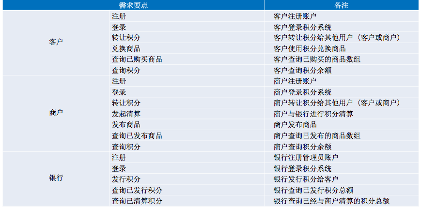
## 快速使用
### 开发工具
内网环境下通过IntelliJ IDEA工具OPEN项目，等待Maven下载。
### 获取token及address
1. 进入趣链开发者平台，可以从[趣链官网](https://www.hyperchain.cn/)进入，也可以[点此](https://www.hyperchain.cn/products/devplatform)直接进入。

2. 点击开始使用，进入开发者平台后，注册一个账号。
3. 登陆成功后页面。

4. 点击添加应用，添加应用信息，如下图，应用Logo可不填。
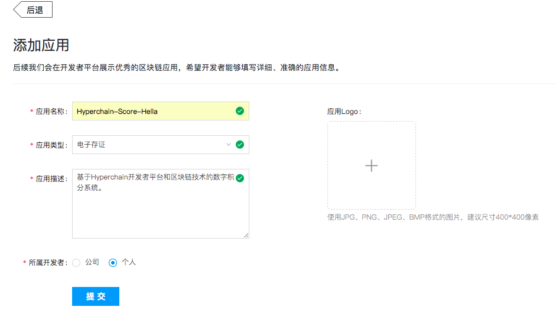
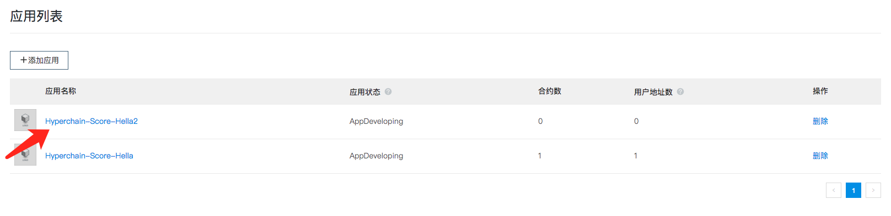
> 因我已创建过项目，此图显示后面加了个2做以区分。按正常流程做就好，不必理会两个名称问题。
5. 点击项目名后，选择合约信息，点击添加合约，其中合约代码为项目中`resources/contractourceCode/ScoreForDeploysol`。
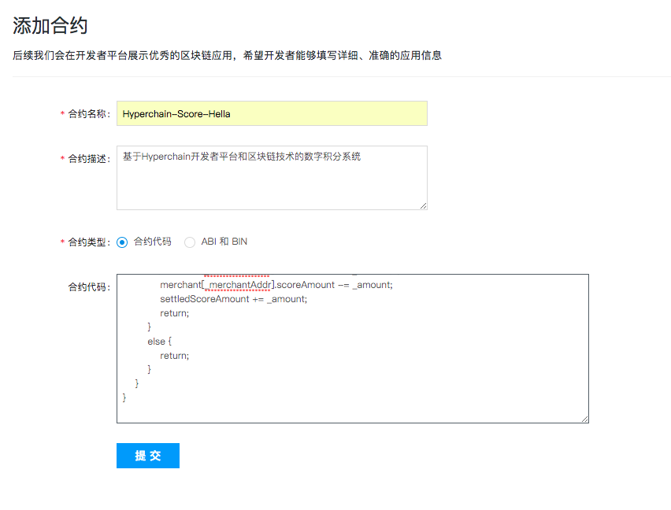
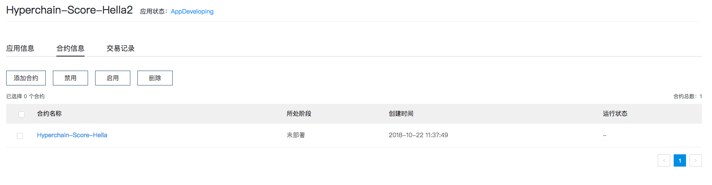
6. 点击合约名后点击部署合约，静候几秒钟
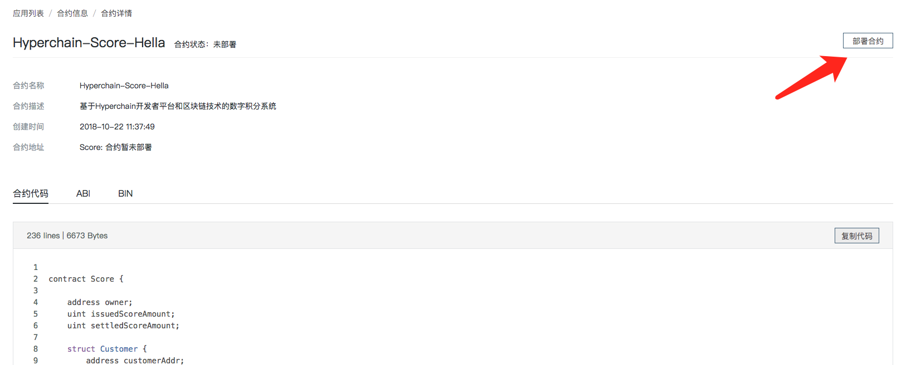
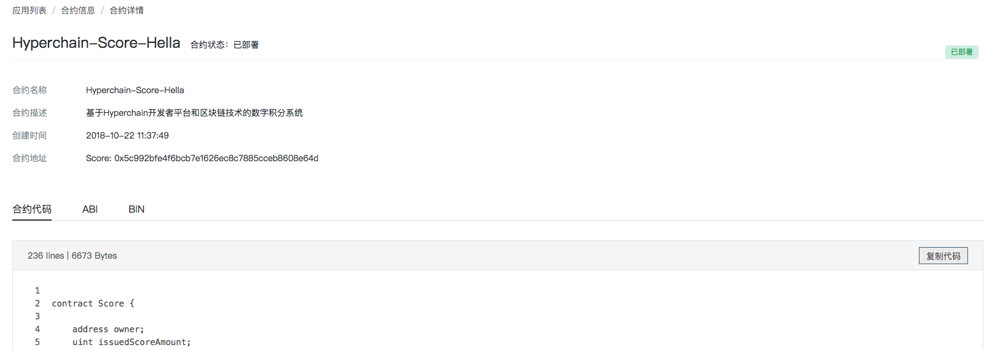
7. 获取项目ABI和合约地址，并将其拷贝到项目中
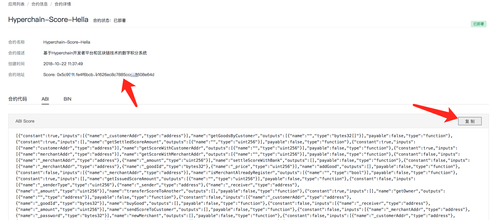
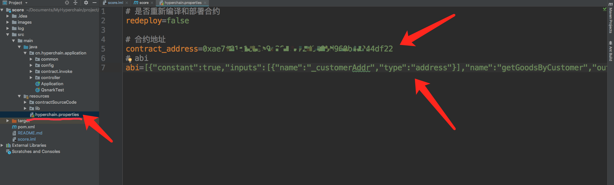
8. 启动项目后，打开swagger([http://localhost:8080/swagger-ui.html](http://localhost:8080/swagger-ui.html))。
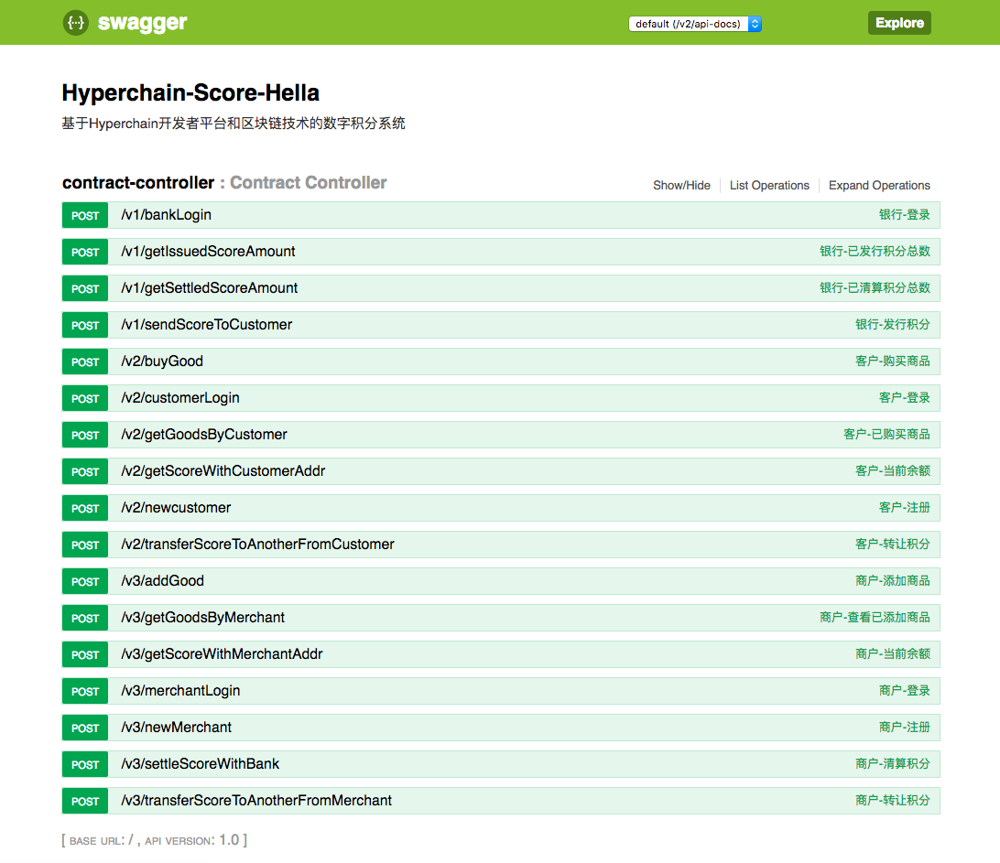
> 本项目是面向接口开发， Swagger 可以生成一个具有互动性的API控制台,开发者可以用来快速学习和尝试API。
9. 大家可以通过输入参数直接点击`Try it out!`按钮开始测试。
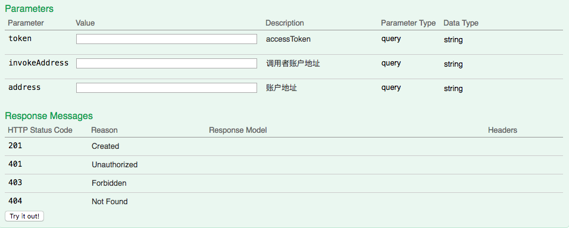
10. 其中token和invokeAddress从开发者平台上获取，如图。client_id和client_secret从应用信息中获取。

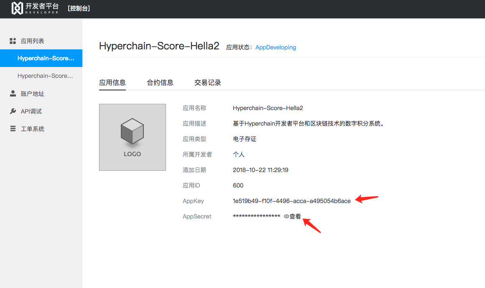
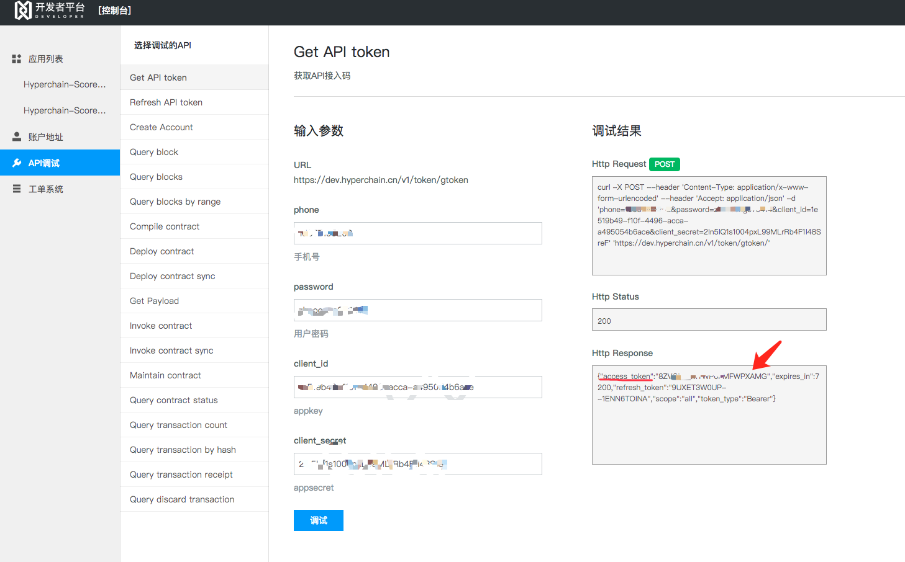
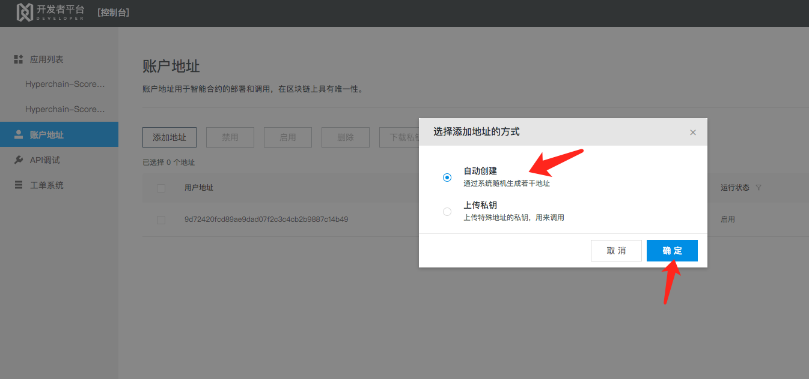
11. 接下来就可以自由的测试啦！
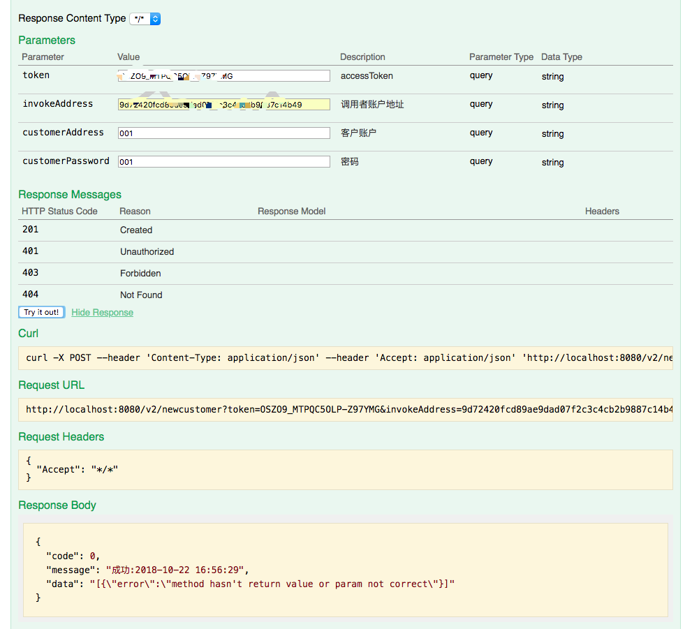
> 注意！token是有时效性的，失效后请重新获取。

> 注意！如图中账户地址，需严格遵循地址格式（16进制）